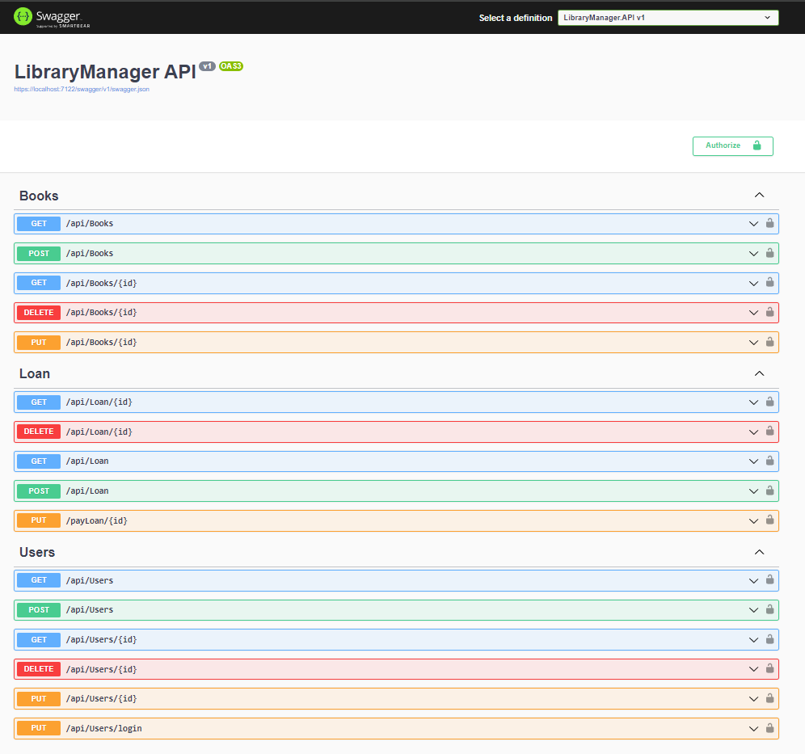

<h1 align="center">Library Manager</h1>

 

  

Este é um projeto que permite o gerenciamento de livros, login e autenticação de usuários. Utilizando Clean Architecture. Além disso, são aplicados diversos padrões de design, incluindo Mediator, CQRS e Repository, para assegurar uma arquitetura robusta e eficiente.

## Tecnologias, Arquitetura e Design Patterns
- Clean Architecture
- Repository
- Entity Framework Core
- CQRS
- MediatR
- JWT (Json Web Token)
- FluentValidation
- Swagger

## Contact

[@Flaviojcf](mailto:flaviojcostafilho@gmail.com)

